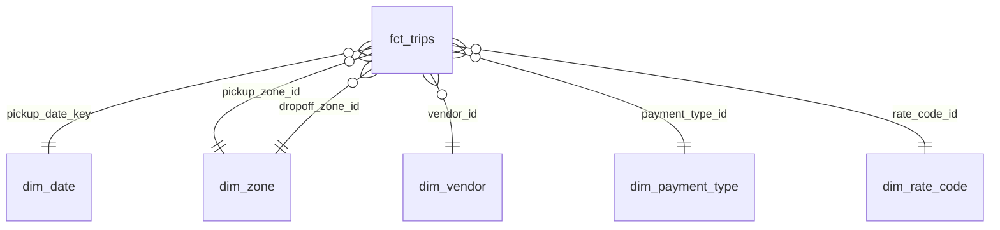

# Data Model

**Grain of `fct_trips`:** one row per valid taxi trip (yellow or green).

```mermaid
erDiagram
    fct_trips }o--|| dim_date : pickup_date_key
    fct_trips }o--|| dim_zone : pickup_zone_id
    fct_trips }o--|| dim_zone : dropoff_zone_id
    fct_trips }o--|| dim_vendor : vendor_id
    fct_trips }o--|| dim_payment_type : payment_type_id
    fct_trips }o--|| dim_rate_code : rate_code_id
```